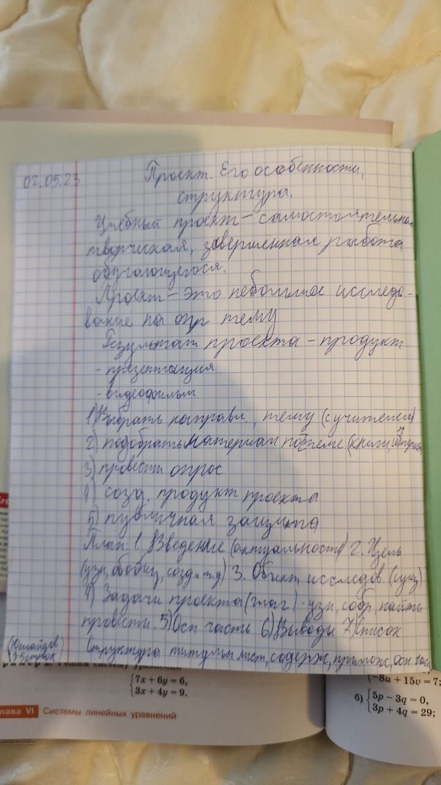

1. Выбрать направление, тему (с учителем)
2. Подобрать материал по теме
3. Провести опров
4. созать продукт проекта
5. Публичная защита

# План
1. Введение (актуальность)
2. Цель: узанть, обобщить, создать и тд
3. Объект исследования
4. Задачи проекта (глагол) - узнать, собрать, найти, провести
5. Основная часть
6. Выводы
7. Список

# Структура
Титульный лист
содержание
Приложение
Основная часть